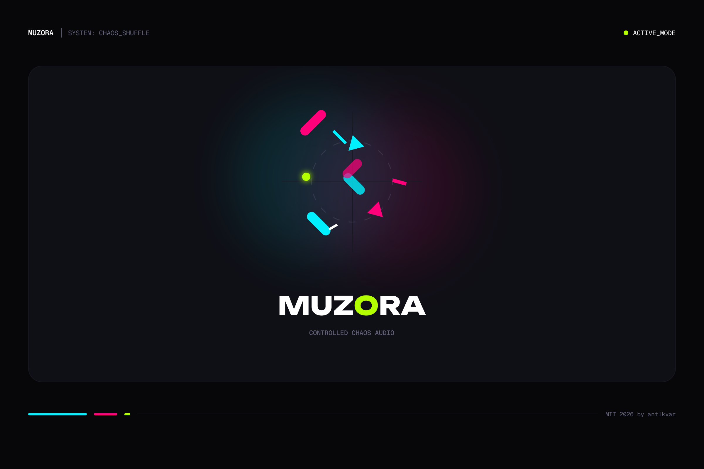
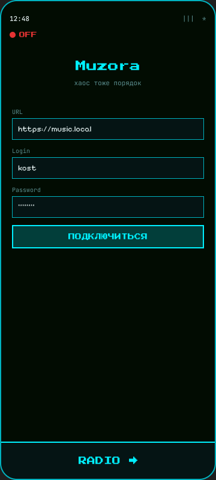
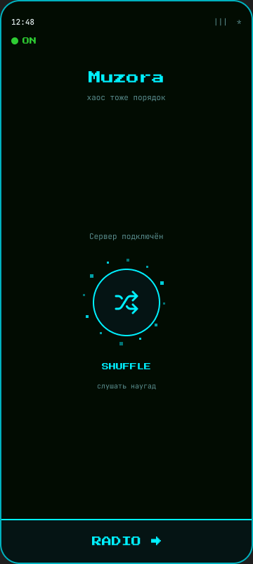
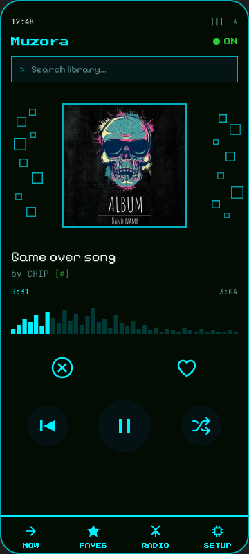
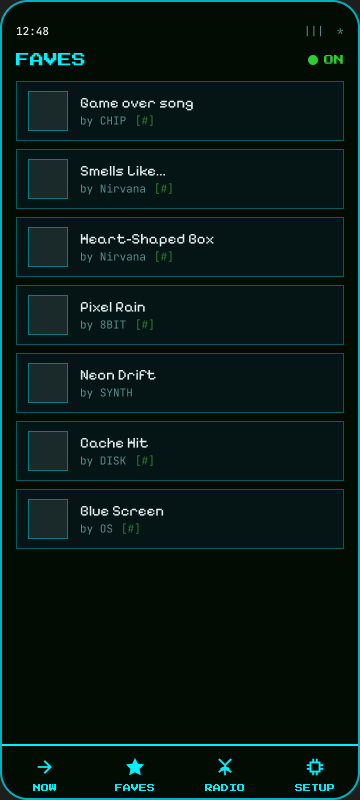
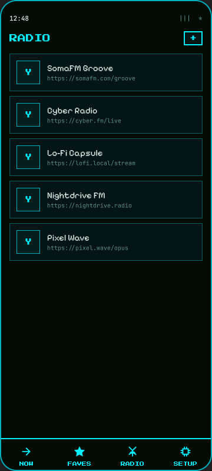

# Muzora

<p align="center">
  
</p>

<p align="center">
  <strong>chaos is also order</strong><br/>
  Simple random <a href="https://www.navidrome.org/">Navidrome</a> / Subsonic client for Android
</p>

<p align="center">
  
</p>

## What it does

Muzora is a small Android client focused on **random listening** from your Navidrome (or any Subsonic-compatible) server — with offline cache, favorites, search, and internet radio.

- Shuffle queue with prefetch and offline playback
- Likes / dislikes, favorites, library search
- Radio stations (from server + custom streams), ICY metadata
- Guest radio before login; English / Russian UI

## Screenshots

| Auth | Connected | Player |
|:---:|:---:|:---:|
|  |  |  |

| Faves | Radio |
|:---:|:---:|
|  |  |

## Install

### Release APK

Download: [`releases/muzora-1.2.2.apk`](releases/muzora-1.2.2.apk)

```bash
adb install -r releases/muzora-1.2.2.apk
```

Or build yourself:

```bash
export ANDROID_HOME=/path/to/Android/Sdk
./gradlew :app:assembleRelease
# APK → app/build/outputs/apk/release/app-release.apk
```

`applicationId`: `com.muzora` · `minSdk` 26 · `version` 1.2.2

### F-Droid

Not on F-Droid yet. Packaging for submission:

- Store listing: [`fastlane/metadata/android/`](fastlane/metadata/android/)
- fdroiddata recipe draft: [`docs/fdroid/com.muzora.yml`](docs/fdroid/com.muzora.yml)
- How to submit: [`docs/fdroid/README.md`](docs/fdroid/README.md)

Source for F-Droid builds: `https://github.com/ant1kvar/Muzora.git` (tag e.g. `v1.2.2`).

Release signing (optional for local APKs): set `keystore.properties` (see `keystore.properties.example`), or
`MUZORA_USE_DEBUG_SIGNING=1` for the Android debug keystore. Without either, `assembleRelease` is unsigned — that is what F-Droid/CI expects.

## Setup

1. Open the app → enter Navidrome / Subsonic URL, username, password → **CONNECT**
2. On the Connected screen tap **SHUFFLE** or **RADIO →**
3. Without an account you can open radio and add stations; **← BACK** returns to login

Server field starts empty (placeholder `https://music.example.com`). Default language is English (SETUP → Language, or EN/RU on the login screen).

## Develop

```bash
./gradlew :app:assembleDebug
adb install -r app/build/outputs/apk/debug/app-debug.apk
```

## Stack

Kotlin · Jetpack Compose · Media3 · Room · DataStore · Coil · Retrofit / OkHttp

## License

MIT — see [LICENSE](LICENSE).
